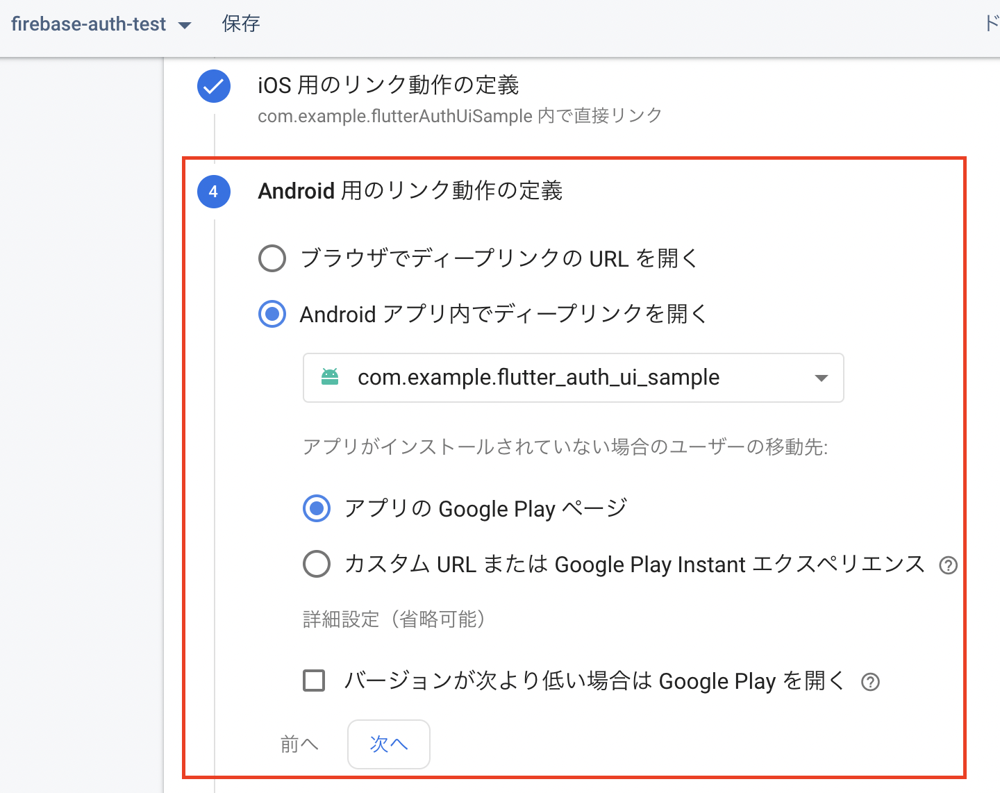

# flutter_auth_ui_sample

## はじめに

このパッケージは、[flutter_auth_ui](https://pub.dev/packages/flutter_auth_ui)を使用した、メールリンク認証のサンプルアプリです。

## 使い方-Firebase準備

### iOS,Android共通

1. Firebaseプロジェクトを作成する
1. メールリンク認証を有効にする  

1. Dynamic Linksを作成する
   1. URL接頭辞を作成する  
   
   1. ダイナミックリンクを作成する  
     
     

### iOS固有

1. Firebaseにアプリを追加する（説明省略）
1. `GoogleService-Info.plist`をアプリ側に組み込む(説明省略)
1. iOSアプリの設定で「App Store ID」、「チームID」を設定する(**AppStoreConnectにアプリを作成しておく必要あり**)

   1. App Store IDの取得元：[AppStoreConnect](https://appstoreconnect.apple.com/) > 該当のアプリ > 一般 > App情報  
     
   1. チームIDの取得元：[Certificates, Identifiers & Profiles](https://developer.apple.com/account/resources/identifiers/list) > 該当アプリのIdentifier  
   
1. Dynamic Linksの「iOS用のリンク動作の定義」を設定する  

### Android固有

1. Firebaseにアプリを追加する（説明省略）
1. `google-services.json`をアプリ側に組み込む(説明省略)
1. Dynamic Linksの「Android用のリンク動作の定義」を設定する  

---

## 使い方-プログラム

### iOS, Android共通

1. main.dart内の`handleURL`を「ダイナミック リンクの設定」の「ディープリンクURL」の値にする

### iOS固有

1. XCodeで`Associated Domains`を設定する  

### Android固有

1. main.dart内の`androidPackageName`を設定する